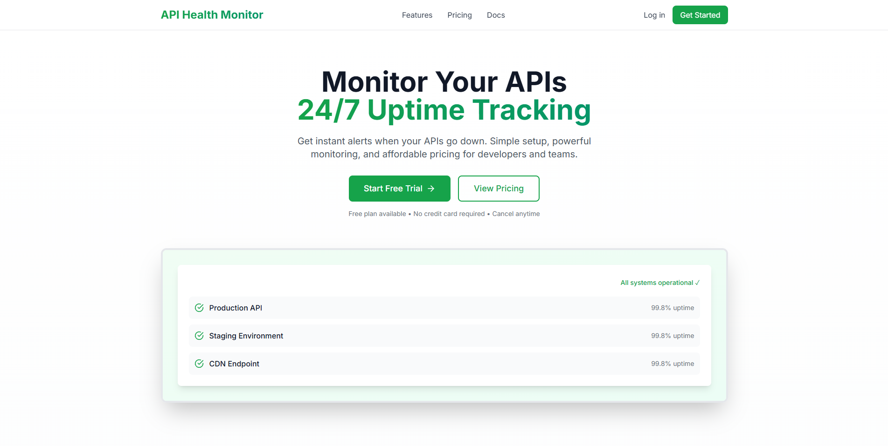
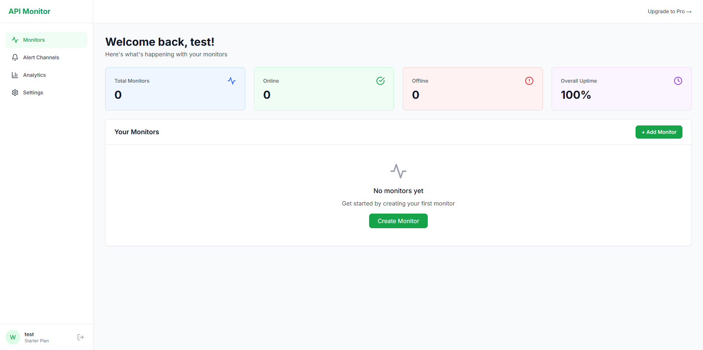
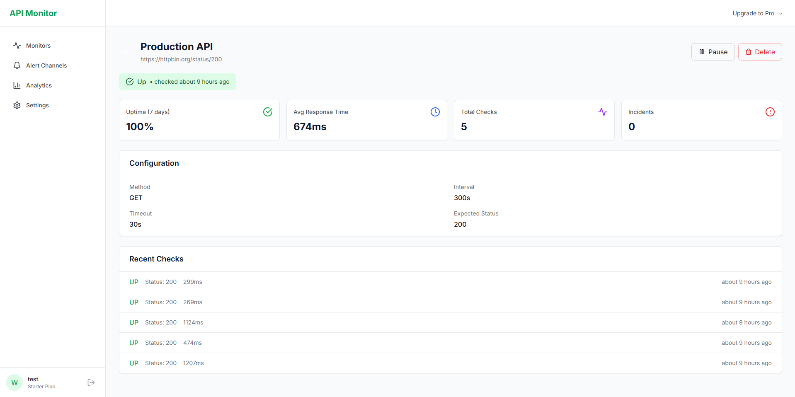
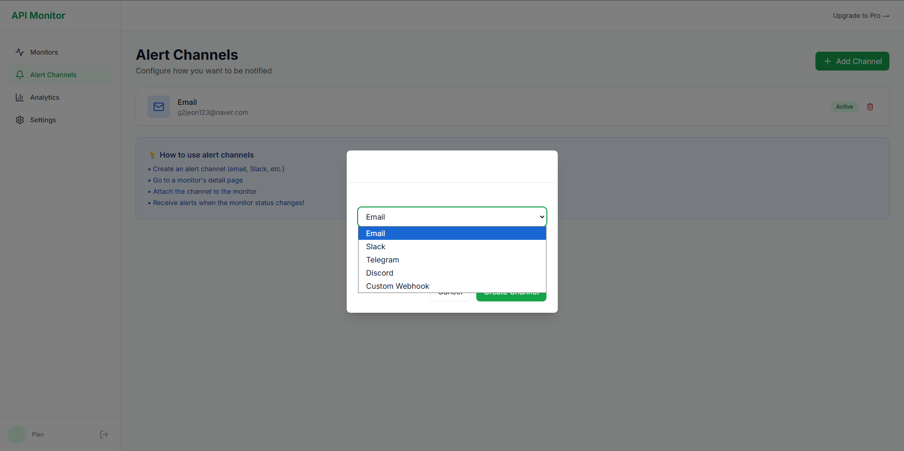
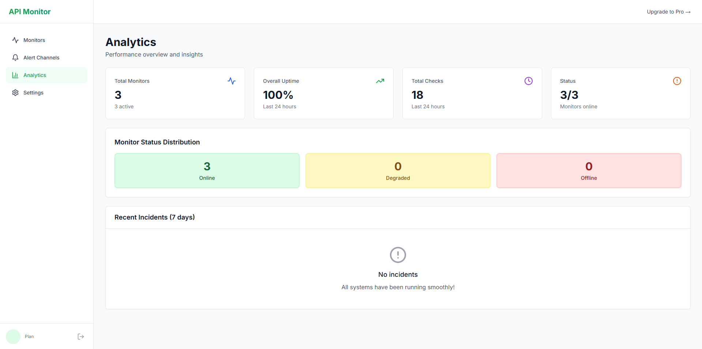

# CheckAPI - API Health Monitor

<div align="center">
  


**Monitor Your APIs 24/7 with Instant Alerts**

[](https://checkapi.io)
[](LICENSE)
[](https://fastapi.tiangolo.com/)
[](https://nextjs.org/)

[Live Demo](https://checkapi.io) · [Report Bug](https://github.com/JEONSEWON/api-health-monitor/issues) · [Request Feature](https://github.com/JEONSEWON/api-health-monitor/issues)

</div>

---

## 🚀 About CheckAPI

CheckAPI is a powerful yet simple **API health monitoring service** that tracks your APIs and websites 24/7. Get **instant alerts** via multiple channels when your services go down. Perfect for developers, startups, and teams who need reliable uptime monitoring without the complexity.

### Why CheckAPI?

- ⚡ **Simple Setup** - Add your first monitor in 60 seconds
- 🔔 **Multi-Channel Alerts** - Email, Slack, Telegram, Discord, or Custom Webhooks
- 📊 **Real-Time Analytics** - Response time, uptime %, incident tracking
- 💰 **Affordable Pricing** - Free tier available, paid plans from $5/month
- 🌐 **Public Status Pages** - Share uptime with your users
- 🔒 **Secure & Reliable** - Built with industry-standard security

---

## 📸 Screenshots

### Landing Page


### Dashboard


### Monitor Details


### Alert Channels


### Analytics


---

## ✨ Features

### Core Monitoring
- 🔍 **HTTP/HTTPS Monitoring** - Support for all HTTP methods (GET, POST, PUT, DELETE, HEAD)
- ⏰ **Customizable Intervals** - From 30 seconds to 1 hour check intervals
- 📈 **Response Time Tracking** - Monitor API performance over time
- 📊 **Uptime Percentage** - Real-time uptime calculations
- 🔴 **Incident Detection** - Automatic down/up state detection
- ✅ **Status Code Validation** - Expected status code checking
- ⏱️ **Timeout Configuration** - Customizable request timeouts

### Alert Channels (5 Options)
- 📧 **Email** - Send alerts to any email address
- 💬 **Slack** - Integrate with your team's Slack workspace
- 📱 **Telegram** - Get instant mobile notifications via Telegram bot
- 🎮 **Discord** - Notify your Discord server channels
- 🔗 **Custom Webhooks** - POST to any webhook endpoint

### Analytics & Reporting
- 📊 **Overview Dashboard** - Total monitors, online/offline status, overall uptime
- 📈 **Response Time Charts** - Visualize API performance trends
- 🔍 **Recent Checks History** - Detailed log of all health checks
- 🚨 **Incident Timeline** - Track all down/up events (7-day history)
- 📉 **Monitor Status Distribution** - At-a-glance system health

### Subscription Plans
- 💳 **LemonSqueezy Integration** - Secure payment processing
- 🎁 **Free Tier** - 3 monitors with 5-minute intervals
- 🚀 **Paid Plans** - Scale up to 100+ monitors with 30-second checks
- 🔄 **Easy Upgrades** - Seamless plan upgrades and downgrades
- 💰 **Flexible Billing** - Monthly subscriptions, cancel anytime

---

## 🛠️ Tech Stack

### Backend
- **Framework:** [FastAPI](https://fastapi.tiangolo.com/) - High-performance Python web framework
- **Task Queue:** [Celery](https://docs.celeryq.dev/) - Distributed task queue for health checks
- **Scheduler:** Celery Beat - Periodic task scheduler
- **Database:** SQLite (with PostgreSQL support)
- **Cache/Broker:** [Redis](https://redis.io/) - Message broker and caching
- **ORM:** SQLAlchemy - Database toolkit and ORM
- **Auth:** JWT (JSON Web Tokens) - Secure authentication
- **Payment:** [LemonSqueezy](https://lemonsqueezy.com/) - Subscription management

### Frontend
- **Framework:** [Next.js 14](https://nextjs.org/) - React framework with App Router
- **Language:** TypeScript - Type-safe JavaScript
- **Styling:** [Tailwind CSS](https://tailwindcss.com/) - Utility-first CSS framework
- **State Management:** Zustand - Lightweight state management
- **HTTP Client:** Axios - Promise-based HTTP client
- **Icons:** Lucide React - Beautiful icon library
- **Notifications:** React Hot Toast - Toast notifications

### Deployment & DevOps
- **Backend Hosting:** [Railway](https://railway.app/) - Backend API + Celery Worker + Redis
- **Frontend Hosting:** [Vercel](https://vercel.com/) - Next.js deployment
- **Domain:** [Namecheap](https://www.namecheap.com/) - Custom domain (checkapi.io)
- **Version Control:** Git + GitHub
- **CI/CD:** Automatic deployment via Railway and Vercel

---

## 🎯 Pricing

| Plan | Price | Monitors | Interval | Features |
|------|-------|----------|----------|----------|
| **Free** | $0/month | 3 | 5 minutes | Email alerts, Public status page |
| **Starter** | $5/month | 20 | 1 minute | All alert channels, Analytics |
| **Pro** | $15/month | 100 | 30 seconds | Team sharing, Priority support |
| **Business** | $49/month | Unlimited | 30 seconds | White-label, Advanced analytics |

✅ All plans include unlimited team members  
✅ No credit card required for free tier  
✅ Cancel anytime, no questions asked

[View Pricing →](https://checkapi.io)

---

## 🚦 Quick Start

### For Users

1. **Sign Up** at [checkapi.io](https://checkapi.io)
2. **Create a Monitor**
   - Enter your API URL
   - Set check interval (5 minutes minimum for free)
   - Choose expected status code (default: 200)
3. **Add Alert Channel**
   - Email, Slack, Telegram, Discord, or Webhook
   - Configure credentials/URLs
4. **Monitor Your API**
   - Receive alerts when your API goes down
   - Track uptime and response times

### For Developers

See [ARCHITECTURE.md](docs/ARCHITECTURE.md) for system design details.

#### Backend Setup
```bash
# Clone repository
git clone https://github.com/JEONSEWON/api-health-monitor.git
cd api-health-monitor/backend

# Install dependencies
pip install -r requirements.txt

# Set up environment variables
cp .env.example .env
# Edit .env with your configuration

# Run database migrations
# (SQLite auto-creates on first run)

# Start API server
uvicorn app.main:app --reload

# Start Celery worker (in separate terminal)
celery -A app.celery_app worker --beat --loglevel=info
```

#### Frontend Setup
```bash
cd frontend

# Install dependencies
npm install

# Set up environment variables
cp .env.local.example .env.local
# Edit .env.local with API URL

# Start development server
npm run dev
```

Visit `http://localhost:3000`

---

## 📚 Documentation

- [Architecture Overview](docs/ARCHITECTURE.md) - System design and components
- [Tech Stack Details](docs/TECH_STACK.md) - Technologies and libraries used
- [Alert Setup Guide](backend/ALERT_SETUP.md) - Configure alert channels
- [LemonSqueezy Integration](backend/LEMONSQUEEZY_SETUP.md) - Payment setup
- [Development Progress](PROGRESS.md) - Build log and changelog
- [Branding Assets](design/BRANDING.md) - Logo and design resources

---

## 🎨 Branding

CheckAPI uses a modern, clean design with a focus on reliability and uptime.

- **Primary Color:** Green (#10B981) - Represents success and stability
- **Logo:** Upward trend line in a square frame
- **Font:** Inter (Google Fonts)

See [design/BRANDING.md](design/BRANDING.md) for full brand guidelines and assets.

---

## 🤝 Contributing

Contributions are welcome! Please feel free to submit issues and pull requests.

1. Fork the repository
2. Create your feature branch (`git checkout -b feature/AmazingFeature`)
3. Commit your changes (`git commit -m 'Add some AmazingFeature'`)
4. Push to the branch (`git push origin feature/AmazingFeature`)
5. Open a Pull Request

---

## 📝 License

This project is licensed under the MIT License - see the [LICENSE](LICENSE) file for details.

---

## 🙏 Acknowledgments

Built with:
- [FastAPI](https://fastapi.tiangolo.com/) - Modern Python web framework
- [Next.js](https://nextjs.org/) - React framework
- [Railway](https://railway.app/) - Backend deployment
- [Vercel](https://vercel.com/) - Frontend deployment
- [LemonSqueezy](https://lemonsqueezy.com/) - Payment processing

Special thanks to the open-source community! 💚

---

## 📬 Contact

- **Website:** [checkapi.io](https://checkapi.io)
- **GitHub:** [@JEONSEWON](https://github.com/JEONSEWON)
- **Issues:** [Report a bug](https://github.com/JEONSEWON/api-health-monitor/issues)

---

<div align="center">

**Built with ❤️ by developers, for developers**

[Get Started for Free →](https://checkapi.io)

</div>
